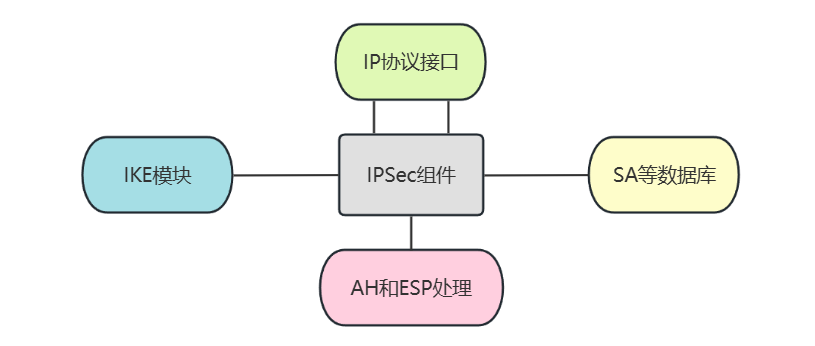

## 一、单项选择题
```html
1.密码学的目的是（）。
A. 研究数据压缩			
B. 研究数据解密
C. 研究数据保密			
D. 研究漏洞扫描
```
::: details 点我查看答案 & 解析
`C`
:::


```html
2.数据机密性安全服务的基础是（）。
A. 数据完整性机制			
B. 数字签名机制
C. 访问控制机制			
D. 加密机制
```
::: details 点我查看答案 & 解析
`D`
:::

```html
3.数字签名要预先使用单向Hash函数进行处理的原因是（）。
A. 多一道加密工序使密文更难破译
B. 提高密文的计算速度
C. 缩小签名密文的长度，加快数字签名和验证签名的运算速度
D. 保证密文能正确还原成明文
```

::: details 点我查看答案 & 解析
`C`
:::


```html
4.基于通信双方共同拥有的但不为别人所知的秘密，利用计算机强大的计算能力，以该秘密作为加密和解密密钥的认证是（）。
A. 公钥认证			
B. 零知识认证
C. 共享密钥认证			
D. 口令认证
```

::: details 点我查看答案 & 解析
`C`
:::

---

```html
5.PKI管理对象不包括（）。
A. ID和口令			
B. 证书
C. 密钥			
D. 证书撤消列表
```

::: details 点我查看答案 & 解析
`A`

公钥基础设施（Public Key Infrastructure，PKI）是一种基于公钥技术实现的，
提供数据机密性、完整性、身份认证和不可否认性等安全服务的，普适性和标准化安全平台。

PKI包括`认证中心CA`、注册机构、资料库、密钥管理、证书撤销列表CRL等组件，涉及认证中心、
证书申请者(持有者)和验证者三类实体，
其中数字证书是PKI的基本要素，认证中心CA是PKI的核心。
PKI通过可信第三方CA为证书申请者发布证书，实现了证书持有者身份与证书的绑定，
使证书持有者能接受验证者的验证并获得信任，从而为通信双方提供了一种建立信任关系的方式。
>[!note]
> **公钥基础设施PKI**
> 
> PKI证书主要采用X.509国际标准，包含以下信息：
>- 版本号：证书使用了哪个版本的X.509标准；
>- 序列号：CA为该证书分配的唯一序列号，证书被撤消时该序列号将被放入CRL中；
>- 签名算法标识符：所使用的签名算法；
>- 发布者的名称；
>- 有效期：包括证书的生效时间和失效时间；
>- 证书持有者的名称；
>- 证书持有者的公钥信息：包括证书持有者的公钥和公钥算法；
>- 发布者的唯一标识符；
>- 证书持有者的唯一标识符；
>- 扩展信息：X.509 v3和v4可使用一个或多个扩展字段，附加有关该证书的额外说明信息； 
>- 发布者的数字签名：CA所使用的签名算法标识和签名值。

:::


```html
6.IPSec协议不包含的组件是（）。
A. AH协议			
B. PGP协议
C. ESP协议			
D. 安全联盟SA
```

::: details 点我查看答案 & 解析
`B`

IPSec是一种开放标准的网络层安全框架结构，通过使用加密为基础的安全服务以确保在IP网络上进行安全通信。
比如，Windows系列用的就是IETF IPSec 工作组开发的标准。



- 1. AH(Authentication Header) 协议

  AH用来向IP数据包（IP 报头+数据负载）提供身份验证、完整性与抗重播攻击。但是它不提供机密性，即它`不对数据进行加密`。
  数据可以读取，但是禁止修改。AH使用哈希算法签名数据包。
  例如，使用计算机 A 的 Alice 将数据发送给使用计算机 B 的 Bob。IP 报头、AH 报头和数据的完整性都得到保护。
  这意味着 Bob 可以确定确实是 Alice 发送的数据并且数据未被修改。
  AH被置于IP报头与IP负载之间。在IP 报头的协议字段使用 51 来标识AH。AH可以独立使用，也可以与ESP协议组合使用。

- 2. ESP(Encapsulated Security Payload) 协议

    ESP封装安全负载协议是IPSec体系结构中另一个主要协议，它提供IP层加密和验证数据源，以抵御网络监听，保证机密性。
    因为AH虽然可以保护通信免受篡改,但并不对数据进行加密。
	ESP通过加密需要保护的数据以及在ESP的数据部分放置这些加密的数据来提供机密性，且其加密采用`对称密钥加密算法`，
	根据用户安全要求，这个机制既可以用于加密一个传输层的段（如：TCP、UDP、ICMP、IGMP）——传输模式，
    也可以用于加密一整个的IP 数据报——隧道模式。封装受保护数据是非常必要的，这样就可以为整个原始数据报提供机密性。

    ESP头可以放置在IP头之后、上层协议头之前，即：IP数据负载部分之前（传输模式）；或者在被封装的IP头之前（隧道模式）。
    IANA分配给ESP的协议标识值为50，在ESP头前的协议头总是在“next head”字段（IPv6）或“协议”（IPv4）字段里包含该值 50。
    ESP提供机密性、数据起源验证、无连接的完整性、抗重放和有限业务流机密性。ESP可以独立使用，也可与 AH 组合使用。

:::


```html
7.（ ）属于应用层使用的安全协议。
A. SSL			
B. SET
C. IPSec			
D. TLS
```
::: details 点我查看答案 & 解析
`B`

- SET (Secure Electronic Transaction) 是一种`应用层`的安全协议，主要用于在电子商务中保障交易的安全。它提供了加密、身份验证和数据完整性等功能，通常用于支付系统。
- SSL (Secure Sockets Layer) 和 TLS (Transport Layer Security) 是`传输层`的协议，用于在客户端和服务器之间的通信中提供安全保护。
- IPSec (Internet Protocol Security) 是`网络层`的安全协议，主要用于保护IP网络中数据的安全性，包括加密、认证、数据完整性等。
:::

---

```html
8.包过滤型防火墙原理上是基于（ ）进行分析的技术。
A. 物理层			
B. 数据链路层
C. 网络层			
D. 应用层
```
::: details 点我查看答案 & 解析
`C`
:::

---

```html 
9.计算机病毒是计算机系统中一类隐藏在（ ）上蓄意破坏的捣乱程序。
A. 内存			
B. 软盘
C. 存储介质			
D. 云盘

```
::: details 点我查看答案 & 解析
`C`
:::


```html
10.“公开密钥密码体制”的含义是（）。
A. 将所有密钥公开			
B. 将私有密钥公开，公开密钥保密
C. 将公开密钥公开，私有密钥保密			
D. 两个密钥相同
```

::: details 点我查看答案 & 解析
`C`
:::


```html
11.攻击者截获并记录了从A到B的数据，于是从早些时候所截获的数据中提取出信息重新发往B称为（）。
A. 中间人攻击			
B. 字典攻击
C. 强力攻击			
D. 重放攻击
```

::: details 点我查看答案 & 解析
`D`

中间人攻击：攻击者在通信过程中实时介入，可以实时地对通信数据进行操作。
重放攻击：攻击者在通信结束后，将截获的数据在另一个时间点重新发送。

:::

---

```html
12.PKI的主要组成不包括（）。
A. 证书授权CA			
B. 安全套接层SSL
C. 注册授权RA			
D. 证书撤销列表CRL
```

::: details 点我查看答案 & 解析
`B`
:::


```html
13.（ ）协议必须提供认证服务。
A. AH			
B. ESP
C. CSMA/CD			
D. 以上皆是
```

::: details 点我查看答案 & 解析
`A`
:::


```html
14.下列选项中能够用在网络层的协议是（）。
A. SSL			
B. PGP
C. PPTP			
D. IPSec
```
::: details 点我查看答案 & 解析
`D`
:::

---

```html
15.（ ）协议是一个用于提供IP数据报完整性、身份认证和可选的抗重播保护的机制，但不提供数据机密性保护。
A. AH协议			
B. ESP协议
C. IPSec协议			
D. PPTP协议
```

::: details 点我查看答案 & 解析
`A`
:::


```html 
16.IPSec协议中负责对IP数据报加密的部分是（）。
A. 封装安全负载ESP			
B. 鉴别头AH
C. Internet密钥交换IKE			
D. 以上都不是
```

::: details 点我查看答案 & 解析
`A`
:::


```html
17.防火墙用于将Internet和内部网络隔离，（ ）。
A. 是防止Internet火灾的硬件设施
B. 是维护网络和信息安全的软件和硬件设施
C. 是保护通信线路不受破坏的软件和硬件设施
D. 是起抗电磁干扰作用的硬件设施
```

::: details 点我查看答案 & 解析
`B`
:::


```html
18.A方有一对密钥（KA公开，KA秘密），B方有一对密钥（KB公开，KB秘密），A方向B方发送数字签名，
对信息M加密为：M’= KB公开（KA秘密（M））。则B方收到密文的解密方案是（）。
A. KB公开（KA秘密（M’））			
B. KA公开（KA公开（M’））
C. KA公开（KB秘密（M’））			
D. KB秘密（KA秘密（M’））
```

::: details 点我查看答案 & 解析
`C`
:::


```html 
19.从安全属性对各种网络攻击进行分类，其中阻断攻击是针对（ ）的攻击。
A. 机密性			
B. 可用性
C. 完整性			
D. 真实性
```
::: details 点我查看答案 & 解析
`B`

从安全属性的角度来看：

**阻断攻击**（例如拒绝服务攻击，DoS）是针对 **可用性 (Availability)** 的攻击。  
这类攻击的目标是使系统或网络资源不可用，从而阻止合法用户访问服务。

:::


```html
20.攻击者用传输数据来冲击网络接口，使服务器过于繁忙以至于不能应答请求的攻击方式是（）。
A. 拒绝服务攻击			
B. 地址欺骗攻击
C. 会话劫持			
D. 信号包探测程序攻击
```

::: details 点我查看答案 & 解析
`A`
:::


```html
21.CA属于PKI安全体系结构中定义的（）。
A. 认证交换机制			
B. 通信业务填充机制
C. 路由控制机制			
D. 公证机制
```

::: details 点我查看答案 & 解析
`D`
:::

---

```html 
22.访问控制是指确定（ ）以及实施访问权限的过程。
A. 用户身份					
B. 用户和资源的总量
C. 可被用户访问的资源				
D. 系统是否遭受入侵
```

::: details 点我查看答案 & 解析
`A`
:::

```html
23.PKI支持的服务不包括（）。
A. 非对称密钥技术及证书管理			
B. CRL列表服务
C. 对称密钥的产生和分发			
D. 访问控制服务
```
::: details 点我查看答案 & 解析
`D`
:::
```html
24.目前，VPN使用了（ ）技术保证了通信的安全性。
A. 隧道协议、身份认证和数据加密
B. 身份认证、数据加密
C. 隧道协议、身份认证
D. 隧道协议、数据加密
```

::: details 点我查看答案 & 解析
`A`
:::
```html
25.IPSec VPN不太适合用于（ ）。
A. 已知范围的IP地址的网络
B. 固定范围的IP地址的网络
C. 动态分配IP地址的网络
D. TCP/IP协议的网络
```
::: details 点我查看答案 & 解析
`C`
:::
```html
26.假设使用一种加密算法，它的加密方法很简单：将每一个字母加5，即a加密成f。这种算法的密钥就是5，那么它属于（ ）。
A. 古典加密技术			
B. 分组密码技术
C. 公钥加密技术			
D. 单向散列函数密码技术
```
::: details 点我查看答案 & 解析
`A`
:::
```html
27.用于实现身份鉴别的安全机制是（ ）。
A. 加密机制和数字签名机制
B. 加密机制和访问控制机制
C. 数字签名机制和路由控制机制
D. 访问控制机制和路由控制机制
```
::: details 点我查看答案 & 解析
`A`
:::

```html
28.身份鉴别是安全服务中的重要一环，用于实现（ ）。
A. 真实性    
B. 完整性    
C. 可用性    
D. 可控性
```
::: details 点我查看答案 & 解析
`A`
:::

```html
29.公钥基础设施的英文缩写是（ ）。
A. PKI    
B. PKC    
C. PMI    
D. PGP
```
::: details 点我查看答案 & 解析
`A`
:::

```html
30.信息安全的基本属性是（ ）。
A. 机密性    
B. 可用性    
C. 完整性    
D. 以上都是
```
::: details 点我查看答案 & 解析
`D`
:::
```html
31.PKI体系中CA是指（ ）。
A. 注册中心			
B. 证书权威机构
C. 密钥管理中心		
D. 安全联盟
```
::: details 点我查看答案 & 解析
`B`
:::

```html
32.机密性服务提供信息的保密，机密性服务包括（ ）。
A. 文件机密性				
B. 信息传输机密性
C. 通信流的机密性		
D. 以上3项都是
```
::: details 点我查看答案 & 解析
`D`
:::

```html
33. DES的中文含义是（ ）。
A. 高级加密标准			
B. 椭圆曲线加密标准
C. 数据加密标准			
D. 对称加密标准
```
::: details 点我查看答案 & 解析
`C`
:::
```html
34.根据所依据的数学难题，公钥密码算法可分为除（ ）之外的以下几种类型。
A. 模幂运算问题
B. 大整数因子分解问题
C. 离散对数问题
D. 椭圆曲线离散对数问题
```
::: details 点我查看答案 & 解析
`A`
:::
```html
35.证书撤销列表的英文缩写是（ ）。
A. CRC    
B. PEM    
C. CRL    
D. IDEA
```
::: details 点我查看答案 & 解析
`C`
:::
```html
36.密码学在信息安全中的应用是多样的，以下（ ）不属于密码学应用。
A. 生成各种网络协议	
B. 消息认证，确保信息完整性
C. 进行身份认证	
D. 加密技术，保护传输信息
```
::: details 点我查看答案 & 解析
`A`
:::
```html
37.某公司的工作时间是上午8点半至12点，下午1点至5点半，每次系统备份需要一个半小时，下列适合作为系统数据备份的时间是（ ）。
A. 上午8点    
B. 中午12点    
C. 下午3点    
D. 凌晨1点
```
::: details 点我查看答案 & 解析
`D`
:::
```html
38.容灾的目的和实质是(  )。
A. 数据备份			
B. 心理安慰
C. 保持信息系统的业务持续性		
D. 系统的有益补充
```
::: details 点我查看答案 & 解析
`C`
:::
```html
39. 基于网络的入侵检测系统的信息源是（ ）。
A. 系统的审计日志		
B. 事件分析器
C. 应用程序的事务日志文件		
D. 网络中的数据包
```
::: details 点我查看答案 & 解析
`D`
:::
```html
40.误用入侵检测技术的核心问题是（ ）的建立以及后期的维护和更新。
A. 异常模型			
B. 规则集处理引擎
C. 网络攻击特征库		
D. 审计日志
```
::: details 点我查看答案 & 解析
`C`
:::
```html
41.使用漏洞库匹配的扫描方法，能发现( )。
A. 未知的漏洞		
B. 已知的漏洞
C. 自行设计的软件中的漏洞
D. 所有的漏洞
```
::: details 点我查看答案 & 解析
`B`
:::
```html
42.防火墙提供的接入模式不包括( )。
A. 网关模式    
B. 透明模式    
C. 混合模式    
D. 旁路模式
```
::: details 点我查看答案 & 解析
`D`
:::
```html
43.在安全协议中，ESP和SET的中文含义分别是（ ）。
A. 认证头、设置	
B. 封装安全负载、安全电子交易
C. 封装安全负载、设置	
D. 认证头、安全电子交易
```
::: details 点我查看答案 & 解析
`B`
:::
```html
44.信息安全管理领域的权威标准是（ ）。
A. ISO15408		
B. ISO17799/ISO27001
C. ISO9001	
D. ISO14001
```
::: details 点我查看答案 & 解析
`B`
:::
```html
45.在口令登录系统中，用户在提交账号、口令的哈希值时，通常会在计算中加入一个从服务器获得的随机数，这样做是为了抵抗（ ）。
A. 差分攻击    
B. 中间人攻击    
C. 重放攻击  
D. 流量分析
```
::: details 点我查看答案 & 解析
`C`
:::
```html
46.社会工程学常被黑客用于（ ）
A. 口令获取    
B. ARP攻击    
C. 重放攻击    
D. DDOS攻击
```
::: details 点我查看答案 & 解析
`A`
:::
```html
47.一个完整的密码体制，不包括以下（ ）要素。
A. 明文空间    
B. 密文空间    
C. 统计空间    
D. 密钥空间
```
::: details 点我查看答案 & 解析
`C`
:::
```html
48.对称加密算法不包括（ ）。
A. 3-DES    
B. IDEA    
C. RSA    
D. AES
```
::: details 点我查看答案 & 解析
`C`
:::
```html
49.自然灾害引起的安全问题，属于（ ） 。
A. 物理安全    
B. 法律安全    
C. 人事安全    
D. 技术安全
```
::: details 点我查看答案 & 解析
`A`
:::
```html
50.采用具有一定安全性质的硬件或软件，保护信息系统的安全，属于（ ）。
A. 物理安全   
B. 人事安全    
C. 法律安全    
D. 技术安全
```
::: details 点我查看答案 & 解析
`D`
:::
```html
51.由消息明文容易计算消息摘要，但由消息摘要无法计算消息明文。这种性质被称为（ ）。
A. 单向性    
B. 散列性    
C. 确定性    
D. 弱无碰撞性
```
::: details 点我查看答案 & 解析
`A`
:::
```html
52.主体所能访问的客体列表，称为（ ）。
A. 授权表    
B. 能力表    
C. 稀疏矩阵    
D. 访问控制矩阵
```
::: details 点我查看答案 & 解析
`A`
:::
```html
53.未经许可，但成功获得对系统某项资源的访问权，并更改了该项资源，称为（ ）。
A. 窃取   
B. 篡改   
C. 伪造   
D. 拒绝服务
```
::: details 点我查看答案 & 解析
`B`
:::
```html
54.未经许可，在系统中产生虚假数据，称为（ ）。
A. 窃取
B. 篡改   
C. 伪造   
D. 拒绝服务
```
::: details 点我查看答案 & 解析
`C`
:::
```html
55.未经许可，直接或间接获得了对系统资源的访问权，从中获得有用数据，称为（ ）。
A. 窃取    
B. 篡改   
C. 伪造    
D. 拒绝服务
```
::: details 点我查看答案 & 解析
`A`
:::
```html
56.防止信息的非授权泄露，称为（ ）。
A. 机密性   
B. 完整性   
C. 可用性   
D. 可控性
```
::: details 点我查看答案 & 解析
`A`
:::
```html
57.保持信息不被篡改的特性，称为（ ）。
A. 机密性   
B. 完整性   
C. 可用性   
D. 可控性
```
::: details 点我查看答案 & 解析
`B`
:::
```html
58.合法授权用户能正常使用资源的性质，称为（ ）。
A. 机密性    
B. 完整性   
C. 可用性   
D. 可控性
```
::: details 点我查看答案 & 解析
`C`
:::
```html
59.在授权范围内控制信息的流向，称为（ ）。
A. 保密性    
B. 完整性   
C. 可用性    
D. 可控性
```
::: details 点我查看答案 & 解析
`D`
:::
```html
60.不能否认自己的行为，称为（ ）。
A. 抗抵赖性   
B. 完整性   
C. 可用性   
D. 可控性
```
::: details 点我查看答案 & 解析
`A`
:::
```html
61.数据信号的抗干扰能力，称为（ ）。
A. 可认证性
B. 可靠性    
C. 可用性    
D. 可控性
```
::: details 点我查看答案 & 解析
`B`
:::
```html
62.防止非法用户进入系统的技术，称为（ ）。
A. 身份鉴别    
B. 权限管理    
C. 信息流控制    
D. 数据加密
```
::: details 点我查看答案 & 解析
`A`
:::
```html
63.保证所有的访问都是经过授权的，称为（ ）。
A. 数字签名   
B. 访问控制    
C. 信息流控制    
D. 数据加密
```
::: details 点我查看答案 & 解析
`B`
:::
```html
64.阻止传输过程中数据被窃取的最好方法是（ ）。
A. 身份鉴别   
B. 访问控制    
C. 信息流控制  
D. 数据加密
```
::: details 点我查看答案 & 解析
`D`
:::
```html
65.监视、记录、控制用户活动的机制称为（）。
A. 身份鉴别    
B. 审计    
C. 管理    
D. 加密
```
::: details 点我查看答案 & 解析
`B`
:::

```html
66.下列选项中（ ）是信息安全五个基本属性之一。
A. 可信性   
B. 可用性    
C. 可审计性    
D. 可靠性
```
::: details 点我查看答案 & 解析
`B`
:::
```html
67.2017年6月1日起我国第一部基础性信息安全法律（ ）正式施行。
A. 网络安全法					
B. 安全基础保护法     
C. 个人信息保护法			
D. 数据安全法
```
::: details 点我查看答案 & 解析
`A`
:::
```html
68.可信计算用于解决（ ）。
A. 设备安全    
B. 数据安全    
C. 内容安全    
D. 行为安全
```
::: details 点我查看答案 & 解析
`D`
:::

```html
69.（ ），中央网络安全和信息化领导小组成立。
A. 2014年2月			
B. 2020年3月     
C. 2008年7月			
D. 2000年1月
```
::: details 点我查看答案 & 解析
`A`
:::
```html
70.下面不属于PKI证书组成部分的是（ ）。
A. 证书持有者的公钥			
B. 证书有效期
C. 发布者的数字签名			
D. 证书验证者的唯一标识符
```
::: details 点我查看答案 & 解析
`D`
:::
```html
71.0Day漏洞是指（ ）。
A. 只在当天存在. 第二天就失效的漏洞
B. 已被公开且发布了补丁的漏洞
C. 补丁发布前已被掌握或公开的漏洞
D. 生命周期为一天的漏洞
```
::: details 点我查看答案 & 解析
`C`
:::
```html
72.用户身份鉴别是通过（ ）完成
A. 口令验证    
B. 审计策略    
C. 存取控制    
D. 查询功能
```
::: details 点我查看答案 & 解析
`A`
:::
```html
73.以下加密算法中，加密速度最快的是（ ）。
A. RSA
B. DES    
C. ElGamal  
D. 3-DES
```
::: details 点我查看答案 & 解析
`B`
:::
```html
74.（ ）不是防火墙的主要技术类型。
A. 包过滤防火墙			
B. 状态检测防火墙
C. 数据审计防火墙	
D. 应用网关防火墙
```
::: details 点我查看答案 & 解析
`C`
:::
```html
75.基于离散对数的加密算法是（ ）。
A. RSA    
B. AES    
C. IDEA    
D. ElGamal
```
::: details 点我查看答案 & 解析
`D`
:::


## 二、多项选择题
```html
1. 系统数据备份包括对象有（  ）。
   A. 配置文件		B. 日志文件		C. 用户文档		D. 系统设备文件
```
::: details 点我查看答案 & 解析
`ABD`
:::
```html
2. 防火墙的局限性包括（  ）。
   A. 防火墙不能防御绕过了它的攻击
   B. 防火墙不能消除来自内部的威胁
   C. 防火墙不能防御来自外部的攻击
   D. 防火墙不能阻止病毒感染过的程序和文件进出网络
```
::: details 点我查看答案 & 解析
`ABD`
:::
```html
3. 病毒传播的途径有（  ）。
   A. 移动硬盘		B. 网络浏览		C. 电子邮件		D. 程序文件
```
::: details 点我查看答案 & 解析
`ABCD`
:::
```html
4. 计算机病毒具有以下特点（  ）。
   A. 传染性			B. 可激发性			C. 潜伏性			D. 破坏性
```
::: details 点我查看答案 & 解析
`ABCD`
:::

```html
5. 任何人不得在电子公告服务系统中发布含有下列内容之一的信息： （  ）。
   A. 反对宪法所确定的基本原则的. 危害国家安全，泄露国家秘密，颠覆国家政权，破坏国家统一的
   B. 损害国家荣誉和利益的；煽动民族仇恨. 民族歧视，破坏民族团结的
   C. 破坏国家宗教政策，宣扬邪教和封建迷信的
   D. 散布谣言. 淫秽. 色情. 赌博. 暴力. 凶杀. 恐怖或者教唆犯罪的
```
::: details 点我查看答案 & 解析
`ABCD`
:::

```html
6. 为了保障互联网的运行安全，对有下列行为之一，构成犯罪的，依照刑法有关规定追究刑事责任：（  ）。
   A. 侵入国家事务、国防建设、尖端科学技术领域的计算机信息系统
   B. 故意制作、传播计算机病毒等破坏性程序，攻击计算机系统及通信网络，致使计算机系统及通信网络遭受损害
   C. 违反国家规定，擅自中断计算机网络或者通信服务，造成计算机网络或者通信系统不能正常运行
   D. 非法截获、篡改、删除他人电子邮件或者其他数据资料，侵犯公民通信自由和通信秘密
```
::: details 点我查看答案 & 解析
`ABCD`
:::

```html
7.  信息的安全属性包括（  ）。
    A. 机密性 		B. 完整性 		C. 可用性 		D. 真实性
```
::: details 点我查看答案 & 解析
`ABCD`
:::

```html
8.  DES属于（  ）。
    A. 对称密码体制 			B. 凯撒密码体制
    C. 非对称密码体制 		D. 公钥密码体制
```
::: details 点我查看答案 & 解析
`A`
:::
```html
9.  RSA属于（  ）。
    A. 非对称密码体制 		B. 公钥密码体制
    C. 对称密码体制 			D. 古典密码体制
```
::: details 点我查看答案 & 解析
`AB`
:::
```html
10. 包过滤路由器的优点包括（  ）。
    A. 保护整个网络，减少暴露的风险 		B. 对用户透明，不需要过多设置
    C. 可以进行数据包过滤 				D. 仅仅保护重点网络
```
::: details 点我查看答案 & 解析
`ABC`
:::
```html
11. 防火墙的作用包括（  ）。
    A. 防止易受攻击的服务 					B. 站点访问控制
    C. 集中安全性 							D. 增强保密，强化私有权
```
::: details 点我查看答案 & 解析
`ABCD`
:::

```html
12. PKI体系下的保密性服务机制包括 （  ）。
    A. 生成一个对称密钥 				B. 用对称密钥加密数据
    C. 将加密后的数据发送给对方 		D. 再另外生成一组非对称密钥
```
::: details 点我查看答案 & 解析
`ABC`
:::
```html
13. 数字签名用于避免（ ）。
    A. 否认 	B. 伪造 		C. 冒充 		D. 篡改
```
::: details 点我查看答案 & 解析
`ABCD`
:::
```html
14. （ ）属于数字签名算法。
    A. Fiat-Shamir算法		B. Diffie-Hellman算法
    C. RSA算法				D. ISAKMP算法
```
::: details 点我查看答案 & 解析
`AC`
:::
```html
15.  PKI的要件包括 （ ）。
     A. CA						B. 证书资料库
     C. 密钥备份及恢复系统		D. 证书撤销列表
```
::: details 点我查看答案 & 解析
`ABD`
:::
```html
16. 以下算法中，对称加密算法包括（  ）。
    A.  DES		B. AES		C. IDEA			D. 3-DES
```
::: details 点我查看答案 & 解析
`ABCD`
:::
```html
17. AES的密钥长度可以为（  ）比特。
    A. 64		B. 128		C. 192			D. 256
```
::: details 点我查看答案 & 解析
`BCD`
:::
```html
18. （  ）属于密钥交换和管理协议。
    A. Diffie-Hellman密钥交换协议	B. 安全联盟密钥管理协议ISAKMP
    C. Internet密钥交换协议IKE		D. RSA密钥管理协议
```
::: details 点我查看答案 & 解析
`ABC`
:::
```html
19. （  ）属于安全管理的内容。
A．安全风险		B.安全需求		C.安全策略		D.安全评估
```
::: details 点我查看答案 & 解析
`ABCD`
:::
```html
20.（  ）属于被动攻击。
A. 截获			
B. 窃取			
C. 窃听			
D. 流量分析
```
::: details 点我查看答案 & 解析
`CD`
:::

## 三、填空题

1. 容灾就是减少灾难事件发生的可能性以及限制灾难对!!( 关键业务流程 )!!所造成影响的一整套行为。
2. 数据备份的目的是为了在!!( 系统数据 )!!崩溃时能够快速地恢复数据。
3. !!( CA )!!是PKI系统安全的核心。
4. 公钥密码体制有两种基本模型：一种是加密模型；另一种是!!( 认证 )!!模型。
5. 数字水印应具有3个基本特性：隐蔽性、 !!( 鲁棒性 )!!和安全性。
6.	如果加密密钥和解密密钥!!( 相同 )!!，这种密码体制称为对称密码体制。
7. DES算法密钥是!!( 64 )!!位，其中密钥有效位是 !!( 56 )!!位。
8. Hash函数是接受变长数据输入，并生成!!( 定长 )!!数据输出的函数。
9. !!( 数字签名 )!!是笔迹签名的模拟，是一种包括防止源点或终点否认的认证技术。
10. ISO 17799/ISO 27001最初是由英国提出的!!( 安全管理标准 )!!。
11. 信息安全中所面临的威胁攻击是多种多样的，一般将这些攻击分为两大类!!(主动攻击)!!和被动攻击。
12. 密码技术的分类有很多种，根据加密和解密所使用的密钥是否相同，可以将加密算法分为：对称密码体制和!!(非对称密码体制)!!。
13. 密码分析是研究密码体制的破译问题，根据密码分析者所获得的数据资源，可以将密码分析分为：!!(惟密文分析)!!、 已知明文分析、选择明文分析、选择密文分析和!!(选择文本分析)!!。
14. 一个完整的信息安全保障体系，应当包括!!(安全策略)!!、保护、检测、响应、 恢复五个主要环节，这就是PPDRR模型的内容。
15. 网络信息安全主要包括信息交换安全和!!(网络系统安全)!!两类技术。
16. !!(密码学)!!是实现安全信息交换的基础。
17. DES的工作模式有加密和!!(解密)!!两种。
18. DES使用了分组密码设计的两个基本原则：!!(混淆)!!和扩散。
19. IDEA是作为迭代的分组密码实现的，使用!!(128)!!位的密钥和8个循环。
20. !!(公钥基础设施)!!是一种基于公钥技术实现的，提供数据机密性、 完整性、身份认证和!!(不可否认性)!!等安全服务的，普适性和标准化安全平台。
21. !!(证书)!!是PKI的基本要素。
22. !!(安全联盟)!!是IPSec的基础, 是通信双方建立的一种协定,决定了用来保护数据包的协议、转码方式、密钥以及密钥有效期等。
23. 在IPsec体系中，用于实现身份和完整性验证的协议是!!( AH )!!，用于实现数据加密的协议是!!( ESP )!!。
24. 静态的网络检测技术是!!( 漏洞扫描 )!!，动态的网络检测技术是!!( 入侵检测 )!!。
25. 访问控制授权包括!!( 用户身份验证 )!!和用户权限控制两种安全措施。
26. 可信计算平台TCP是将!!( BIOS )!!作为完整性测量的信任根，TMP作为完整性报告的信任根。
27. 数字水印主要有!!( 鲁棒性水印 )!!和脆弱性水印。
28. 从检测原理上看，入侵检测包括异常检测和!!( 误用检测 )!!两种实现技术。
29. 信息安全具有四个侧面：设备安全、数据安全、内容安全与行为安全。!!(可信计算)!!用于解决行为安全。
30. !!( 匿名认证 )!!是一种既能验证身份权限信息，又能隐藏具体身份的技术，是实现网络服务中隐私保护的主要技术手段。