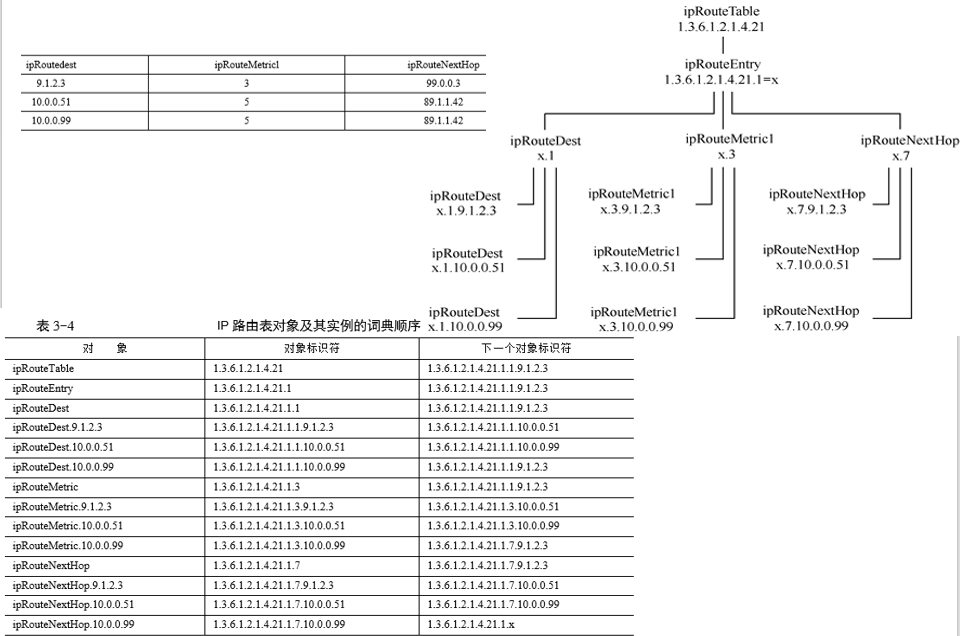
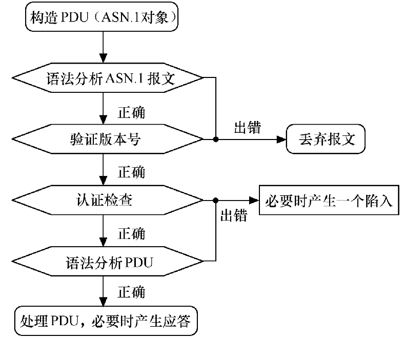
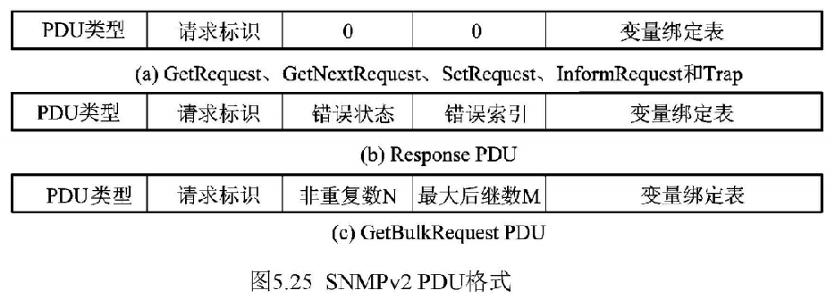

@[pdf width="100%" ratio="10:7" zoom="25"](./pdf/Snmp.pdf)
## 1.网络管理概论
### 1.1 网络管理的几个概念
<mark>网络管理的任务：</mark>
1. 监测网络的运行状态
2. 控制网络的运行

<mark>网络管理的目标：</mark>
1. 有效性 2. 可靠性 3. 开放性 4. 综合性 5. 安全性 6. 经济性 

<mark>网络管理的对象：</mark>
1. 硬件资源 2. 软件资源

被管对象(Managed Object)的集合称之为MIB(Management Information Base)，网络中所有被管理的对象的信息都集中在MIB中。

<mark>网络管理的标准：</mark>

国际标准化组织(ISO)推出的OSI系统管理标准是`CMIS`与`CMIP`

Internet工程工作小组(IETF)组织推出管理标准`SNMP`(最初使用是简单网关监控协议SGMP)

#### RFC文档
之后陆续公布在`RFC`(Request For Comments)文件中，即定义和规范SNMP协议的文档：
>[!important]
>- RFC1155(SMI(SNMP的子集))
>- RFC1157(SNMP)
>- RFC1212(MIB定义)
>- RFC1213(MIB-2定义) 


1991年产生了远程网络监控`RMON`v1，1995年发展成`RMON`v2。这组标准定义了监控`局域网`网络通信管理信息库，配合SNMP使用。

### 1.2 网络管理的体系结构
#### CMIP & SNMP
CMIP体系结构是一个通用的模型，他能够适应各种开放系统之间的管理通信和操作，开放关系之间既可以是平等的，也可以是主从关系，因此它
既能够进行分布式的管理，也能够进行集中式的管理。

SNMP体系结构起初是一个`集中式模型`。在一个系统中只有一个顶层管理站，管理站下设有多个代理，管理站中运行管理进程。

从SNMPv2开始才用于`分布式模型`，在此模型中可以有多个顶层管理站，这些管理站被称为管理服务器。在管理服务器和代理服务器之间
又加入了中间服务器。
```html
-----------------------------------------------------
**管理服务器**  顶层管理站1号 顶层管理站2号 顶层管理站3号...
-----------------------------------------------------                   
**中间服务器**  (与管理服务器通信：运行代理进程；与代理通信运行：运行管理进程)
-----------------------------------------------------
*****代理*****  代理1号 代理2号 代理3号...
```

| 网络管理体系结构 | 区别           |
|----------|--------------|
| CMIP     | 通用、完备、ISO提出  |
| SNMP     | 简单、实用、IETF提出 |


#### 网络管理的基本模型
- 管理者：网络指令的发出者
- 网络代理：位于被管理者内部，负责把管理者发出的指令转化为本设备内部携带的指令
- 网络管理协议：网络管理者和网络代理之间通信的标准
- MIB库：被管对象的管理信息都被放在MIB中

>[!important]
>网络管理模型的核心是一对相互通信的系统管理实体。在这种体系结构中，一个系统中的管理进程担当管理者角色，
> 而另一个系统中的对等实体担当代理者角色，代理者负责提供对被管对象的访问。前者称为网络管理者，后者被称为管理代理。

#### 网络管理的模式
1. 集中式网络管理模式
2. 分布式网络管理模式
3. 混合式网络管理模式

#### 网络管理的软件结构
1. 用户接口软件(用户通过网络管理接口与管理专用软件交互作用，监视和控制网络资源。)
2. 管理专用软件(支持多种网络管理应用，适用于各种网络设备和网络配置。)
3. 管理支持软件(包括MIB访问模块和通信协议栈。)

### 1.3网络管理的功能
#### 1. 故障管理
   - `故障检测和报警功能`：故障监视代理要随时记录网络系统出错的情况和可能引起故障的事件，并把这些信息存储在运行日志数据库中。
   - `故障预测功能`：对各种可能引起故障的参数建立门限值并随时监视参数值变化，一旦超过门限值，就发送警报。
   - `故障诊断和定位功能`：对设备和通信线路进行测试，找出故障原因和地点。

#### 2. 配置管理
   - `网络配置信息`
     1. 网络设备的拓扑关系，即存在性和连接关系。
     2. 网络设备的域名、IP地址，即寻址信息。
     3. 网络设备的运行特性，即运行参数。
     4. 网络设备的备份操作参数，即是否备份、备份启用条件。
     5. 网络设备的配置更改条件。

   - `配置管理的主要功能`
     1. 定义配置信息。
     2. 设置和修改设备属性。
     3. 定义和修改网络元素间的互连关系。
     4. 启动和终止网络运行。
     5. 发行软件。
     6. 检查参数值、互连关系和报告配置现状。

#### 3. 安全管理
   - `安全信息维护`
     1. 记录系统中出现的各类事件
     2. 追踪安全设计试验，自动记录安全的重要事件
     3. 报告和接收侵犯安全的警示信号
     4. 经常维护和检查安全记录。
     5. 备份和保护敏感的文件。
     6. 研究每个正常用户的活动形象。
   - `资源访问控制`
     1. 资源访问控制包括认证服务和授权服务，以及对敏感资源访问授权的决策过程。
     2. 访问控制服务的目的是保护各种网络资源，这些资源中与网络管理有关的主要内容包括：
        安全编码、源路由和路由记录信息、路由表、目录表、报警门限、计费信息
   - `网络安全技术`
     1. 数据加密技术
     2. 防火墙技术
     3. 网络安全扫描技术
     4. 网络入侵监测技术
     5. 黑客诱骗技术

#### 4. 性能管理
   - `性能管理的基本功能`
     1. 实时采集与网络性能相关的数据。
     2. 分析和统计数据。
     3. 维护并检查系统的运行日志。
     4. 性能的预警。
     5. 生成性能分析报告。
   - `常用的网络性能测评指标`
     1. 吞吐量。
     2. 包（帧）延迟。
     3. 丢包（帧）率。
     4. 可用性。
     5. 响应时间。
     6. 利用率。
   - `网络性能的测评方法`
    由于局域网操作系统平台的多样性，网络设备、传输介质及网络拓扑结构都有很大的区别，因此网络性能的测评非常复杂。
     1. 直接测量法。对网络的信道利用率、碰撞分布和吞吐率等参数进行动态数据统计，以得到测评结果。
     2. 模拟法。给网络建立数学模型，运用仿真程序通过数学计算得出网络相关参数指标。同时也可以与实测结果进行比较，经过多次校正得到真实的测评结果。
     3. 分析法。通过采用概率论、过程论和排队论等对各种网络进行模拟，其分析结果可用于对未来的网络进行优化设计。


#### 5. 计费管理
- `计费管理功能`
  1. 计算网络建设及运营成本，包括设备、网络服务、人工费用等成本。
  2. 统计网络及其所包含的资源的利用率，确定计费标准。
  3. 将应该缴纳的费用通知用户。
  4. 支持用户费用上限的设置。
  5. 在必须用多个通信实体才能完成通信时，能够把使用多个管理对象的费用结合起来。
  6. 保存收费账单及必要的原始数据，以备用户查询和质疑。

- `计费管理的类型`
  1. 基于网络流量计费。网络流量计费是根据用户的网络或者用户的主机在一段时间内使用的网络流量收取用户费用的一种计费方式，主要用于专线（如DDN、E1、X.25线路等）接入用户。
  2. 基于使用时间计费。使用时间计费是根据用户使用网络的时间长短来收取用户费用的一种计费方式。该如ADSL接入网络的用户
  3. 基于网络服务计费。网络服务计费是根据用户使用网络服务的次数或时间来收取用户费用的一种计费方式。收取费用的服务包括电子邮件、数据库信息查询、光盘检索、网络游戏等。
- `计费管理的子过程`
  1. 使用率度量过程。
  2. 计费处理过程。
  3. 账单管理过程。
- `计费管理的管理对象`
  1. 使用率度量控制对象。
  2. 使用率度量数据对象。
  3. 使用率记录。

## 2.抽象语法表示

### 2.1 网络数据表示

`表示层`的功能是提供统一的网络数据表示；
在互相通信的端系统中至少有一个`应用实体`（如SNMP、TELNET、FTP等）和一个`表示实体`（即ASN.1）。
- 应用层：抽象语法表示`ASN.1`
(Abstract Syntax Notation)是一种形式语言
提供统一的网络数据表示，用于定义应用数据的`抽象语法`和应用协议数据单元的结构。
OSI或SNMP管理信息库，都是用ASN.1定义的。
- 表示层：基本编码规则`BER`
(Basic Encoding Rule)是一种编码规则，
用ASN.1定义的应用数据在传送过程中按照BER变换成比特串。

### 2.2 ASN.1
当一个应用想发送一个数据结构时，可以将数据结构与其对应的ASN.1标识一起传给表示层。

#### ASN.1的文本约定
  1. 多个空格和空行等效于一个空格。
  2. 用于表示值和字段的标识符、类型指针和模块名由大小写字母、数字和短线组成。
  3. 标识符以小写字母开头。
  4. 类型指针和模块名以大写字母开头。
  5. ASN.1定义的内部类型全部用大写字母表示。
  6. 关键字全部用大写字母表示。
  7. 注释以一对短线（--）开始，以一对短线或行尾结束。

---
#### 抽象数据类型
在ASN.1中，每一个数据类型都有一个标签(tag)(除了CHOICE和ANY)
标签有`类型`(如INTEGER)和`值`(如0)，数据类型由标签的类型和值唯一确定，这种机制在数据编码时有用。

标签类型分为以下4种：
1. `通用标签`：UNIVERSAL表示，由标准定义的。
2. `应用标签`：APPLICATION表示，是由某个具体应用定义的类型。
3. `上下文专用标签`：Context-Specific表示，这种标签在一定范围中适用。
4. `私有标签`：PRIVATE表示，用户定义的标签。

> [!note]
> a = int(5)
> a ::= [Application 0] INTEGER   (应用标签)
>
> a ::= [0] INTEGER
>
> b ::= [1] (新标签) INTEGER (老标签)(上下文标签)
>
> c ::= [1] (新标签) IMPLICIT INTEGER (老标签)
---
ANSI.1定义的数据类型有20多种，基础数据类型标签都是UNIVERSAL。

数据类型可分为4大类：
1. `简单类型`，由单一成分构成的原子类型，包括INTEGER，BOOLEAN，...
2. `构造类型`，由两种以上成分构成的构造类型，包括SEQUENCE，SEQUENCE OF,...
3. `标签类型`，由已知类型定义的新类型
4. `其他类型`，包括CHOICE和ANY两种类型

**构造类型**

构造类型有序列和集合两种，分别用`SEQUENCE`和`SEQUENCE OF`表示不同类型和相同类型元素的序列，分别用`SET`和`SET OF`表示不同类型和相同类型元素的集合。
序列和集合的区别是前者的元素是有序的，而后者是无序的。

**标签类型**

标签类型可以是隐含的或明示的，分别用关键字IMPLICIT和EXPLICIT(可省略)表示。隐含标签的语义是用新标签替换老标签，因此编码时只编码新标签。
上例中，3个集合元素的上下文标签都是隐含的，因此编码时只编码上下文专用标签。明示标签的语义是在一个基类型上加上新标签，从而导出一个新类型。
事实上，明示标签类型是把基类型作为惟元素的构造类型，在编码时，新老标签都要编码，可见隐含标签可以产生较短的编码。
但明示标签也是有用的，特别用于基类型未定时，例如基类型为CHOICE或ANY类型。

**其他类型**

CHOICE和ANY是两个没有标签的类型，因为它们的值是未定的，而且类型也是未定的。当这种类型的变量被赋值时，
它们的类型和标签才能确定，可以说标签是运行时间确定的。

#### 子类型
子类型是为了限制父类型的值的集合而导出的类型。
1. 单个值
2. 值区间
3. 允许字符
4. 限制大小
5. 包含子类型
6. 内部子类型


### 2.3 基本编码规则BER
- 用ASN.1表示的变量必须转换为串行的字节流才能在网络中传输。
- 基本编码规则（Basic Encoding Rules，BER）：转换文本ASN.1语法到机读代码的算法

BER传输语法的格式是TLV三元组<标签Tag，长度 Length，值Value>。
  - Tag: 关于标签类别和编码格式的信息；
  - Length: 表示值（Value）字段的数据长度值
  - Value: 包含实际的数据。

BER传输语法是基于八位组（由8比特组成，是编码的基本单位）`大端编码`的
其八位组中的二进制编号从8到1，高8位在左，约定第8位是最高有效位，第1位是最低有效位。

#### 标签字段
```html
                    8   7    6             5   4   3   2   1
UNIVERSAL           0   0   (简单类型)     (标签号>30时，标签字段需要多个字节)
APPLICATION         0   1   (0:简单类型)   (第一个八位组后5位全为1，
CONTEXT-SPECIFIC    1   0   (1:构造类型)    后继八位组除最后一个，
PRIVATE             1   1                  最高位均为1)
```
#### 长度字段
BER编码中Length表示Value部分所占八位组的个数

格式主要有两大类：确定格式和不确定格式
在确定格式中又分为短、长两种格式。
- 采用确定格式，当长度不大于127时，Length只在一个八位组中编码；当长度大于127时，在多个八位组中编码，
此时第一个八位组低七位表示的是Length所占的长度，后续八位组表示Value的长度。
- 采用不确定格式时，Length所在八位组固定编码为0x80，在Value后以两个0x00结尾。
可以在编码没有完全结束的情况下，可以先发送部分消息给对方。


编码规则：
1. 若编码是简单类型，则使用确定格式。
短格式：长度字段仅一个八位组，最高位为0。
长格式：长度字段包含多个八位组，第1个字节最高位为1，其余7位表示后面有多少字节来表示值字段的长度。例如，25510可表示为10000001 11111111
2. 若编码是构造类型，并且编码立即可用，则既可以使用确定格式，也可以使用非确定格式，由发送者选择。
3. 若编码是构造类型，但编码不是立即可用，则使用非确定格式。

### 2.4 宏定义
ASN.1的基本单位是`模块`，类似于C语言中的结构，用于定义一个抽象数据类型ASN.1。

|||
|--|--|
|宏表示|用于定义宏的一种表示机制|
|宏定义|用宏表示定义的一个宏代表宏实例的集合|
|宏实例|用具体的值代替宏定义中的变量而产生的实例|

>[!important]
> - 抽象语法表示ASN.1定义了一组用来描述OSI网络上所传输的数据结构规则。在ASN.1中，每一个数据类型都有一个标签，包括标有类型和值。
> - ANSI.1定义的数据类型有20多种，标签类型都是UNIVERSAL。
> - 用ASN.1定义的应用数据在传送过程中要按照一定的规则变换成比特串，这种规则就是基本编码规则（Basic Encoding Rule，BER）。
> - ASN.1提供了宏定义功能，可用于扩充语法，定义新的类型和值。

## 3.Internet管理信息结构
- MIB：包含被管理资源以及元素信息的数据库
应用于在基于TCP/IP协议的网络
- SMI：定义和构建MIB的通用性框架结构
  - SMI定义了MIB中被管对象使用的数据类型的表示和命名MIB中对象的方法
  - SMI定义了描述管理信息的规则
  - 确定了可以用于MIB中的数据类型并说明对象在MIB内部怎么样表示和命名。

### 3.1 SNMP管理体系结构
在Internet中，网络管理信息存储在MIB中。

Internet最初的网络管理框架由4个文件定义，如图3-5所示，这就是SNMP第一版（SNMPv1）。
- RFC1155定义了管理信息结构（SMI），即规定了管理对象的语法和语义。
SMI主要说明了怎样定义管理对象和怎样访问管理对象
- RFC1212说明了定义MIB模块的方法
- RFC1213则定义了MIB-2管理对象的核心集合。这些管理对象是任何SNMP系统必须实现的。
- RFC1157是SNMPv1的规范文件。

### 3.2 MIB的树结构
层次树结构有3个作用：
1. 表示管理和控制关系
2. 提供结构化的信息组织技术
3. 提供了对象命名机制。

#### MIB的数据类型
MIB中的简单数据类型:INTEGER、OCTET STRING、NULL、OBJECT IDENTIFIER 、SEQUENCE (OF)

MIB中的复杂数据类型:NetworkAddress、IpAddress、Counter、Gauge、TimeTicks、Opaque

- `SYNTAX:`

表示对象类型的抽象语法。INTEGER、OCTET STRING...NetworkAddress、IpAddress、Counter...


- `ACCESS:`

定义对象的访问方式。可选择的访问方式有只读(read-only)、读写(read-write)、只写(write-only)和不可访问(not-accessible)4种(MIB树中的非叶子节点不能访问)。

- `STATUS:`

说明实现是否支持这种对象。
状态子句中定义了
必要的(mandatory)
任选的(optional)
过时的(obsolete)是指老标准支持而新标准不支持的类型
如果一个对象被说明为可取消的(deprecated)，表示当前必须支持这种对象，但在将来的标准中可能被取消。
:::

### 3.3  SNMP管理信息结构
为了规范管理信息模型，SNMP发布了管理信息结构（SMI）。
- RFC 1065描述了SMI,在用于管理TCP/IP网络的MIB中可用的信息的语法和类型。
- SMI定义了SNMP框架所用信息的组织、组成和标识，规定了MIB中被管对象的数据类型及其表示和命名方法。
- SMI的宗旨是保持了MIB的简单性和可扩展性，只允许存储`标量`和`二维数组`，不支持复杂的数据结构。从而简化了操作，加强了互操作性。

SMI提供了以下标准化技术表示管理信息：
（1）定义了MIB的层次结构；
（2）提供了定义管理对象的语法结构；
（3）规定了对象值的编码方法。

按照SMI定义的SNMP管理对象都具有3个属性：
- 名字、语法和编码。
  - 名字即对象标识符，唯一标识一个MIB对象；
  - 语法即如何描述对象的信息，它用抽象语法标记法（ASN.1）来定义对象的数据结构；
  - 编码：描述了一个管理对象的相关信息如何被格式化为适合网络传送的数据段，采用基本编码规则（BER）。

#### 表对象、行对象和列对象
```html
 -- The TCP connection table contains information about this
          -- entity's existing TCP connections.

          tcpConnTable OBJECT-TYPE
              SYNTAX  SEQUENCE OF TcpConnEntry
              ACCESS  not-accessible
              STATUS  mandatory
              DESCRIPTION
                      "A table containing TCP connection-specific
                      information."
              ::= { tcp 13 }

          tcpConnEntry OBJECT-TYPE
              SYNTAX  TcpConnEntry
              ACCESS  not-accessible
              STATUS  mandatory
              DESCRIPTION
                      "Information about a particular current TCP
                      connection.  An object of this type is transient,
                      in that it ceases to exist when (or soon after)
                      the connection makes the transition to the CLOSED
                      state."
              INDEX   { tcpConnLocalAddress,
                        tcpConnLocalPort,
                        tcpConnRemAddress,
                        tcpConnRemPort }
              ::= { tcpConnTable 1 }

          TcpConnEntry ::=
              SEQUENCE {
                  tcpConnState
                      INTEGER,
                  tcpConnLocalAddress
                      IpAddress,
                  tcpConnLocalPort
                      INTEGER (0..65535),
                  tcpConnRemAddress
                      IpAddress,
                  tcpConnRemPort
                      INTEGER (0..65535)
              }

          tcpConnState OBJECT-TYPE
              SYNTAX  INTEGER {
                          closed(1),
                          listen(2),
                          synSent(3),
                          synReceived(4),
                          established(5),
                          finWait1(6),
                          finWait2(7),
                          closeWait(8),
                          lastAck(9),
                          closing(10),
                          timeWait(11),
                          deleteTCB(12)
                      }
              ACCESS  read-write
              STATUS  mandatory
              DESCRIPTION
                      "The state of this TCP connection.

                      The only value which may be set by a management
                      station is deleteTCB(12).  Accordingly, it is
                      appropriate for an agent to return a `badValue'
                      response if a management station attempts to set
                      this object to any other value.

                      If a management station sets this object to the
                      value deleteTCB(12), then this has the effect of
                      deleting the TCB (as defined in RFC 793) of the
                      corresponding connection on the managed node,
                      resulting in immediate termination of the
                      connection.

                      As an implementation-specific option, a RST
                      segment may be sent from the managed node to the
                      other TCP endpoint (note however that RST segments
                      are not sent reliably)."
              ::= { tcpConnEntry 1 }

          tcpConnLocalAddress OBJECT-TYPE
              SYNTAX  IpAddress
              ACCESS  read-only
              STATUS  mandatory
              DESCRIPTION
                      "The local IP address for this TCP connection.  In
                      the case of a connection in the listen state which
                      is willing to accept connections for any IP
                      interface associated with the node, the value
                      0.0.0.0 is used."
              ::= { tcpConnEntry 2 }

          tcpConnLocalPort OBJECT-TYPE
              SYNTAX  INTEGER (0..65535)
              ACCESS  read-only
              STATUS  mandatory
              DESCRIPTION
                      "The local port number for this TCP connection."
              ::= { tcpConnEntry 3 }

          tcpConnRemAddress OBJECT-TYPE
              SYNTAX  IpAddress
              ACCESS  read-only
              STATUS  mandatory
              DESCRIPTION
                      "The remote IP address for this TCP connection."
              ::= { tcpConnEntry 4 }

          tcpConnRemPort OBJECT-TYPE
              SYNTAX  INTEGER (0..65535)
              ACCESS  read-only
              STATUS  mandatory
              DESCRIPTION
                      "The remote port number for this TCP connection."
              ::= { tcpConnEntry 5 }
```
>[!note]
>
> 为什么 tcpConnState 不在 INDEX 中？
>
>INDEX 字段主要用于唯一标识表中的每一行。
>
>tcpConnState 代表 TCP 连接的状态（如 established、closed 等），它是连接的属性，而不是标识连接唯一性的条件。
>
>因此，tcpConnState 不适合放在 INDEX 中。


```html
|XxxTable:X, XxxEntry:X.1, Xxxxxx.1.1/2/3/...|

tcpConnLocalAddress对象的OID：
Xxxxxxx.1.2

15这个实例的OID:
Xxxxxxx.1.5. + Index(10.0.0.9. + 12. + 9.1.2.3. + 15) [[|] + [——]]

0.0.0.0这个实例的OID:
Xxxxxxx.1.2. + Index(0.0.0.0. + 99. + 0.0.0.0. + 0)
```

#### 词典顺序
对象标识符是整数序列，这种序列反映了该对象MIB中的`逻辑位置`，同时表示了一种词典顺序。
只要按照一定的方式（如中序）遍历MIB树，就可以排出所有的对象及其实例的词典顺序。
对象的顺序对网络管理是很重要的。因为管理站可能不知道代理提供的MIB的组成，所以管理站要用某种手段搜索MIB树，在不知道对象标识符的情况下访问对象的值。

例如，为检索一个表项，管理站可以连续发出Get操作，按词典顺序得到预定的对象实例。



## 4.管理信息库
### 4.1 MIB简介

#### system(系统组)


系统（System）组是MIB-2中最基本的一个组，包含一些最常用的被管对象。
- 所有系统都必须包含System组。
- 网络管理系统一旦发现新的系统被加到网络中，首先需要访问该系统的这个组，来获取系统的名称、物理地点和联系人等信息。

用于失效管理（故障管理）的System组对象
1. sysObjectID中的对象标识符标明了实体的生产商
2. sysServices告知设备主要提供了哪些协议层服务。
3. sysUpTime告知一个系统已经运行了多长时间。失效管理查询该对象可以确定实体是否已重新启动。

- sysServices:协议层服务。设L是协议层编号，如果使用了L层的协议，则二进制数值的第L位为1，否则为0。例如，一个主要在第三层运行的路由器将返回值0000100B，即4，而一个运行第四层和第七层服务的主机将返回值1001000B，即72。在不知道设备的功能时，该信息对于问题的解决是有用的。
- sysUpTime:失效管理查询该对象可以确定实体是否已重新启动，如果查询获得的是一个一直增加的值就认为实体是Up的，如果小于以前的值，则自上次查询后系统重新启动了。

#### interfaces(接口组)


**重点**
1. ifIndex(1)接口表惟一的索引项，索引值为1-ifNumber范围
2. ifAdminStatus(7)用于配置接口的管理状态，up(1) down(2) testing(3)[期待状态]
3. ifOperStatus(8)提供一个接口的当前操作状态，up(1) down(2) testing(3)[实际状态]

| **ifAdminStatus** | **ifOperStatus** | **含义**                             |
|-------------------|------------------|-------------------------------------|
| Up(1)            | Up(1)            | 接口正常运行                         |
| Up(1)            | Down(2)          | 接口失败，管理员期望运行但实际不可用  |
| Down(2)          | Down(2)          | 接口关闭，被管理员禁用               |
| Testing(3)       | Testing(3)       | 接口处于测试状态，不可传输数据        |
#### at(地址转换组)


MIB-2中地址转换组的对象已被收编到各个网络协议组（如Ip组）中，保留地址转换组仅仅是为了与MIB-1兼容。
#### ip(IP组)


1. 用于失效管理的Ip组对象
    - IP路由表（ipRouteTable）用于提供路由选择信息，IP路由表中的所有对象用于失效管理。
    - ipRouteDest给出目标地址的网络号，ipRouteIfIndex给出实体外出的接口，ipRouteMetric给出到目标地址的跳数，ipRouteNextHop给出下一站地址。
2. 用于配置管理的Ip组对象
    - IP地址表（ipAddrTable）包含分配给该实体的IP地址的信息，每个地址被唯一地分配给一个物理地址。
    - 在每个ipAddrEntry中，ipAdEntAddr和ipAdEntIfIndex分别告知IP地址和相应的接口，可以使用ipAdEntIfIndex把ipAddrTable项和一个Interfaces组ifTable项关联起来。ipAdEntNetMask给出了子网掩码，而ipAdEntBcastAddr告知广播地址。
    - IP路由表（ipRouteTable）把它的许多对象定义为可读写的，出于配置管理的目的，可以修改、新增、删除路由信息。
3. 用于性能管理的Ip组对象
    - 使用Ip组对象，性能管理应用可以测量实体输入和输出IP流量的百分率。
    - 利用Interfaces组对象，实体接收到的总数据报数为所有接口的ipInUcastPkts和ifNUcastPkts的和，用该和除以`ipInReceives`可以得出接收到的IP数据报的比率。使用对象ipOutRequest可以对实体发送的数据报作类似的计算。
    - 由于缺少系统资源等原因会导致丢弃数据报。对象`ipInDiscards`和`ipOutDiscards`分别给出了数据报在输入和输出时被丢弃的个数。
    
   使用Ip组对象可以计算IP数据报的错误率:
    - IP输入错误率 =(ipInDiscards + ipInHdrErrors + ipInAddrErrors)/ ipInReceives
    - IP输出错误率 =(ipOutDiscards + ipOutNoRoutes)/ ipOutRequests
   
    `ipForwDatagrams`告知设备对IP数据报转发的速率，如果在时刻x和时刻y被两次查询，则可得IP转发速度:
    - IP转发速度 = (ipForwGatagramsy − ipForwDatagramsx)/(y − x)
    - IP输入速度 = (ipInReceivesy − ipInReceivesx)/(y − x)

4. 用于计费管理的Ip组对象
    - Ip组对象ipOutRequests和ipInDelivers可用于计费管理。

#### icmp
了解即可
#### tcp
#### udp
#### egp
#### transmission
#### snmp
请看第五章

## 5. 简单网络管理协议
### 5.1 SNMP的演变
- 1987年11月提出简单网关监控协议(SGMP)
- 简单网络管理协议第一版(SNMPv1)公布在1990年和1991年的几个RFC文件中，即RFC1155(SMI)、RFC1157(SNMP)、RFC 1212(MIB)、RFC 1213(MIB-2)
- 双轨制策略:
  - SNMP满足当前的网络管理需要，并可平稳过渡到新的网络管理标准。
  - 0SI网络管理(CMOT)作为长期解决办法，可提供更全面的管理功能，但需较长开发及接受过程。但0SI MIB采用面向对象模型，开发缓慢，SNMP无法顺利过渡。


### 5.2 SNMPv1
#### SNMPv1协议数据单元
| **PDU 类型**          | **触发方**          | **作用**                         | **方向**           |
|-----------------------|---------------------|----------------------------------|--------------------|
| GetRequest            | 管理站              | 请求指定 MIB 对象的值            | 管理站 → 代理设备   |
| GetNextRequest        | 管理站              | 请求 MIB 树中下一个对象的值      | 管理站 → 代理设备   |
| SetRequest            | 管理站              | 修改 MIB 对象的值                | 管理站 → 代理设备   |
| GetResponse           | 代理设备            | 响应管理站的请求，返回结果        | 代理设备 → 管理站   |
| Trap                  | 代理设备            | 主动通知管理站事件或异常          | 代理设备 → 管理站   |


除Trap PDU之外的四种PDU格式是相同的，共有五个字段：
- PDU类型：GetRequestPDU GetNextRequestPDU SetRequestPDU GetResponsePDU TrapPDU五种类型。
- 请求标识(request-id)：赋予每个请求报文唯一的整数，用于区分不同的请求。由于在具体实现中请求多是在后台执行的，因而当应答报文返回时要根据其中的请求标识与请求报文配对。请求标识的另一个作用是检测由不可靠的传输服务产生的重复报文。
- 错误状态(error-status)：表示代理在处理管理站的请求时可能出现的各种错误，共有6种错误状态，包括noError(0) tooBig (l) noSuchName(2) badValue (3) readOnly(4) genError(5)。对不同的操作，这些错误状态的含义不同。//ResponsePDU
- 错误索引(error-index)：当错误状态非0时指向出错的变量。
- 变量绑定表(variable-binding)：变量名和对应值的表，说明要检索或设置的所有变量及其值。在检索请求报文中，变量的值应为0。

#### 报文发送与接收


#### SNMPv1操作

<mark>1. 检索简单对象</mark>

检索简单标量对象值可用Get操作。如果变量绑定表中包含多个变量，则一次还可以检索多个标量对象的值。接收GetRequest的SNMP实体以请求标识相同的GetResponse响应。
GetResponse 操作具有`原子性`，如果所有请求的对象值可以得到，则给予应答；只要有一个对象的值得不到，则可能返回下列错误条件：

(1) 变量绑定表中的一个对象无法与MIB 中的任何对象标识符匹配，或者要检索的对象是一个数据块(子树或表)，没有对象实例生成。在此情况下，响应实体返回GetResponsePDU中错误状态为`noSuchName`，错误索引设置为一个数，指明有问题的变量。变量绑定表中不返回任何值。

(2) 响应实体可以提供所有要检索的值，但是变量太多，一个响应PDU 装不下，这往往是由下层协议数据单元大小限制的。这时响应实体返回一个应答PDU，错误状态字段置为`tooBig`。

(3) 响应实体如不能提供至少一个对象的值，则返回的PDU中错误状态字段置为`genError`，错误索引置一个数，指明有问题的变量。变量绑定表中不返回任何值。

---
为了说明简单对象的检索过程，这是UDP组的一部分。我们可以在索命令中直接指明对象实例的标识符:

```html
GetRequest( udpInDatagrams.0, udpNoPorts.0, udpInErrors.0, udpOutDatagrams.0)

可以预期得到下面的响应:
GetResponse(udpInDatagrams.0=100,udpNoPorts.0=1, udpInErrors.0=2, udpOutDatagrams.0=200)

用GetNext命令以上的4个值
直接指明对象标识符:
GetNextRequest( udpInDatagrams, udpNoPorts, udpInErrors, udpOutDatagrams)
得到的响应与上例是相同的:
GetResponse( udpInDatagrams.0=100,udpNoPorts.0=l,udpInErrors.0=2,udpOutDatagrams.0=200)
可见标量`对象实例标识符`(例如udpInDatagrams.0)总是紧跟在`对象标识符`(例如udpInDatagrams)后面的。
```

<mark>2. 检索未知对象</mark>

GetNext命令检索变量名指示的下一个对象实例，但并不要求变量名是对象标识符或者是实例标识符。
利用GetNext的检索未知对象的特性可以发现MIB的结构。
```html
例如管理站不知道udp组有哪些变量，先试着发出命令:
GetNextRequest (udp)
得到的响应是:
GetResponse(udpInDatagrams.0=100)
```
<mark>3．检索表对象</mark>
| **ipRouteDest** | **ipRouteMetric** | **ipRouteNextHop** |
|-----------------|------------------|-------------------|
| 9.1.2.3        | 1                | 99.0.0.3         |
| 10.0.0.51      | 2                | 89.1.1.42        |
| 10.0.0.99      | 3                | 89.1.1.42        |
```html
假定管理站不知道该表的行数而想检索整个表则可以连续使用GetNext命令:
GetNextRequest(ipRouteDest,ipRouteMetricl, ipRouteNextHop)
得到了第一实例对象:
GetResponse(ipRouteDest.9.1.2.3=9.1.2.3, ipRouteMetric1.9.1.2.3=3, ipRouteNextHop.9.1.2.3=99.0.0.3)
注意IpRouteDest是IpRouteTable的Index
```

<mark>4. 表的更新和删除</mark>

Set命令用于设置或更新变量的值。其PDU与Get相同，但在变量绑定表中必须包含要设置的变量名和值。
对于Set命令的应答也是GetResponse，同样是原子性的。

```html
//更新
想改变列对象ipRouteMetric1的第一个值，则可以发出命令
SetRequest(ipRouteMetric1.9.1.2.3=9)

得到的应答是:
GetResponse(ipRouteMetric1.9.1.2.3=9)
其效果是该对象的值由3变成了9。

//删除
如果要删除表中的行，则可以把一个对象的值置为invalid:
SetRequest(ipRouteType.7.3.5.3=invalid)

得到的响应说明表行确已删除:
GetResponse(ipRouteType.7.3.5.3=invalid)
```
>[!note]
> 对于上述的表的删除是物理的还是逻辑的，是由具体实现决定的。在MIB-2中，只有两种表是可删除的:ipRouteTable包含ipRouteType，可取值invalid;
> ipNetToMediaTable包含ipNetToMediaType，可取值invalid。

#### SNMPv1的局限性

| 序号 | 限制说明                                     |
|----|---------------------------------------------|
| 1  | 由于轮询性能限制，不适合管理大网络。         |
| 2* | 不适合检索大量数据。                         |
| 3* | 陷入报文是没有应答的，管理站是否收到陷入报文，代理不得而知。这样可能丢掉重要的管理信息。 |
| 4* | 只提供简单团体名认证，安全措施不够。         |
| 5* | 不能直接向被管理设备发送命令。               |
| 6  | 管理信息库MIB-2支持的管理对象有限，不足以完成复杂的管理功能。 |
| 7  | 不支持管理站之间的通信。                     |


### 5.3 SNMPv2
#### 对象的定义
1. 数据类型: SNMPV2增加了两种新的数据类型Unsigned32和Counter64(计数器)。
2. UNITS子句: 在SNMPv2的OBJECT-TYPE宏定义中增加了UNITS子句。用文字说明与对象有关的度量单位。 当管理对象表示一种度量手段（如时间）时这个子句是有用的。
3. MAX-ACCESS子句: 类似于SNMPv1的ACCESS子句，说明最大的访问级别，与授权策略无关。

   SNMPv2定义的访问类型中去掉了`write-only`类，增加了一个与概念行有关的访问类型`read-create（RFC1442）`，表示可读、可写和可生成。还增加了`aceessible-for-notify访问类（RFC1902）`。
4. STATUS子句:
   SNMPv2标准去掉了SNMPv1中的optional和mandatory，只有3种可选状态。
   current表示在当前的标准中是有效的。
   obsolete表示不必实现这种对象
   deprecated表示对象已经过时了，但是为了兼容旧版本实现互操作，实现时还要支持这种对象。

>[!important]
> SNMPv2的5种访问级别由小到大排列如下： 
> 
> not-accessible；accessible-for-notify； read-only；read-write；read-create。

#### 表的定义
与SNMPv1一样，SNMPv2的管理操作只能作用于标量对象，复杂的信息要用表来表示。
按照SNMPv2规范，表是行的序列，而行是列对象的序列。SNMPv2把表分为以下两类：

1. 禁止删除和生成行的表。这种表的最高的访问级别是read-write。在很多情况下这种表由代理控制，表中只包含read-only型的对象。
2. 允许删除和生成行的表。这种表开始时可能没有行，由管理站生成和删除行。行数可由管理站或代理改变。

在SNMPv2表的定义中必含有INDEX或AUGMENTS子句(原表上扩充新的纵列)，但是只能有两者其中之一。

#### 表的操作
允许生成和删除行的表必须有一个列对象，其SYNTAX子句的值为`Rowstatus`，MAX-ACCESS子旬的值为`read-create`这种列叫做概念行的状态列。

状态列(Rowstatus)可取以下6种值。
1. Active(可读写):被管理设备可以使用概念行。
2. NotlnService(可读写):概念行存在，但由于其他原因(下面解释)而不能使用。
3. NotReady(只读):概念行存在，但因没有信息而不能使用。
4. CreateAndGo(只写不读):管理站生成一个概念行实例时先设置成这种状态，生成过程结束时自动变为active，被管理设备就可以使用了。
5. CreateAndWait(只写不读):管理站生成一个概念行实例时先设置成这种状态，但不会自动变成active。
6. Destroy(只写不读):管理站需删除所有的概念行实例时设置成这种状态。

#### 通知与信息模块
=== 略 ===

#### SNMPv2协议数据单元



GetBulkRequest:


InformRequest PDU：
这是管理站发送给管理站的消息，PDU格式与Get等操作相同，变量绑定表的内容与陷入报文一样。但是与陷入不同，这个消息是需要应答的。因此，管理站收到通知请求后首先要决定应答报文的大小，如果应答报文的大小超过本地或对方的限制，则返回错误状态tooBig。


SNMPv2增加的管理站之间的通信机制是分布式网络管理所需要的功能特征，为此引入了通知报文InformRequest和管理站数据库（manager-to-manager MIB）。管理站数据库主要由3 个表组成。

1. snmpAlarmTable：报警表提供被监视的变量的有关情况，类似于RMON 警报组的功能，但这个表记录的是管理站之间的报警信息。
2. snmpEventTable：事件表记录SNMPv2实体产生的重要事件，或者是报警事件，或者是通知类型宏定义的事件。
3. snmpEventNotifyTable：事件通知表定义了发送通知的目标和通知的类型。

### 5.4 SNMPv3管理框架
在RFC 2571描述的管理框架中，以前称做管理站和代理的实体现在统一称做SNMP实体（SNMP Entity）。

实体 = 一个SNMP引擎（SNMP Engine） + 一个或多个有关的SNMP应用（SNMP Application）组成。
## 测试题
### 第一章：网络管理概论
<mark>**填空题**</mark>
1. 国际标准化组织推出的 OSI系统管理标准是!!CMIP!!。
2. Internet工程工作小组（IETF）组织推出管理标准是!!SNMP!!。
3. 对于互联网中的非标准设备， 通过一种叫做!!委托代理!!的设备来进行管理，它与非标准设备之间运行制造商专有的协议。
4. 有两种技术可用于代理和监视器(管理者)之间的通信。一种叫做!!轮询!!;一种叫做事件报告。
5. 在 Internet 中，对网络、设备和主机的管理叫做网络管理，网络管理信息存储在!!MIB库(管理信息库)!!。
6. 连接测试属于故障管理中的!!故障诊断和定位!!功能。

<mark>**选择题**</mark>
```html
1. 在网络管理中，一般采用管理模型是（）
A.管理者/代理
B.客户机/服务器
C.网站/浏览器
D.CSMA/CD
```
::: details 点我查看答案 & 解析
`A`
:::

```html
2. 系统管理操作在对等的开放系统之间进行，一个系统为管理站，另一个系统起下列哪项的作用？
A.管理
B.监视
C.代理
D.探测
```
::: details 点我查看答案 & 解析
`C`
:::

```html
3. 在代理和监视器之间的通信中，代理主动发送信息给管理站的通信机制是（）
A.轮询
B.事件报告
C.定时报告
D.预警
```
::: details 点我查看答案 & 解析
`B`
:::

```html
4. 网络管理软件包括管理专用软件，管理支持软件和（）
A.用户专用软件
B.用户支持软件
C.用户管理软件
D.用户接口软件
```
::: details 点我查看答案 & 解析
`D`
:::

```html
5. ISO定义的系统管理功能域中，测试管理功能属于（）
A.配置管理
B.故障管理
C.性能管理
D.安全管理
```
::: details 点我查看答案 & 解析
`B`
:::

```html
6. 下述各选项中，属于配置功能的范畴的功能是（）
A.测试管理功能
B.数据收集功能
C.工作负载监视功能
D.定义和修改网络元素间的互联关系
```
::: details 点我查看答案 & 解析
`D`
:::

```html
7. 网络管理中的安全管理是保护管理站和代理之间的下列哪项的安全（）
A.信息交换
B.信息存储
C.信息索引
D.完整信息
```
::: details 点我查看答案 & 解析
`A`
:::

```html
8. 以下属于面向服务的性能指标是()
A.可用性
B.吞吐量
C.丢包率
D.利用率
```
::: details 点我查看答案 & 解析
`A`
:::

>[!note]
> 网络管理是指对网络的运行状态进行监测和控制，并能最大限度地满足网络管理者和网络用户对计算机网络的
> 有效性、可靠性、开放性、综合性、安全性和经济性的要求。
> 
> 当前有两种主要的网络管理体系结构，即基于OSI参考模型的公共管理信息协议（CMIP）体系结构与
> 基于TCP/IP参考模型的简单网络管理协议（SNMP）体系结构。
>
> 在网络管理中，一般采用“管理者—代理”的基本管理模型来构建网络管理系统，进行实际的网络管理。
> 网络管理系统的基本模型包括4个要素组成，分别是网络管理者、管理代理、管理信息库和网络管理协议。
当前建立有效的网络管理模式，主要有3种方法：集中式网络管理模式、分布式网络管理模式、混合式网络管理模式。

### 第二章：抽象语法表示
<mark>**填空题**</mark>
1. 表示实体(ASN.1)定义了应用数据的!!抽象语法!!
2. 计算机网络管理中提供统一的网络数据表示的形式语言是!!ASN.1!!
3. ASN.1定义的标签类型可分为四类，分别是 !!通用标签!!、 !!应用标签!! 、 !!上下文专用标签!! 、 !!私有标签!! 。
4. 数据类型可分为四类，分别是 !!简单类型!!、 !!构造类型!! 、 !!标签类型!! 、 !!其他类型!! 。
5. 用SEQUENCE/SET表示 !!不同类型元素!! 的序列/集合，用SEQUENCE OF/SET OF表示 !!相同类型元素!! 的序列/集合
6. 宏定义 由!!类型表示!!(TYPE NOTATION)、!!值表示!!(VALUE NOTATION)和支持产生式 3 部分组成。


<mark>**选择题**</mark>
```html
1. ASN.1定义的数据类型有20多种，其标签值类型都是()
A.UNIVERSAL
B.APPLICATION
C.PUBLIC
D.PRIVATE
```
::: details 点我查看答案 & 解析
`A`
:::

```html
2. 表示不同类型元素集合的构造类型是()
A.SEQUENCE OF
B.SEQUENCE
C.SET
D.SET OF
```
::: details 点我查看答案 & 解析
`C`
:::

```html
3. FamilyMemberName ::= SET{
SonName[1] IMPLICIT IA5String,
MotherName[2] IMPLICIT IA5String OPTIONAL,
FatherName[3] IMPLICIT IA5String OPTIONAL
} 三个元素使用的标签[1][2][3]是()
A.通用标签
B.应用标签
C.上下文标签
D.私有标签
```
::: details 点我查看答案 & 解析
`C`
:::
```html
4. 在ASN.1的数据类型分类中由己知类型定义的新类型是()
A.简单类型
B.构造类型
C.其他类型
D.标签类型
```
::: details 点我查看答案 & 解析
`D`
:::

```html
5. 下面属于ASN.1定义的简单类型的是()
A.OBJECT IDENTIFIER类型
B.构造类型
C.标签类型
D.CHOICE类型
```
::: details 点我查看答案 & 解析
`A`
:::

```html
6. 以下对ASN.1的简单数据类型的描述正确的是()
A.简单类型就是BOOLEAN、INTEGER、BIT STRING、OCTETSTRING、REAL和ENUMERATED这是基本类型。
B.枚举类型ENUMERATED也能进行任何算术运算。
C.20000721182053.7是UTCTime类型的一个值，表示2000年7月21日，当地时间18点20分53.7秒。
D.20000721182053.7是GeneralizedTime类型的一个值，表示2000年7月21日，当地时间18点20分53.7秒。
```
::: details 点我查看答案 & 解析
`D`
:::

```html
7. 在ASN.1子类型的描述中，值区间这种方法只能应用于()
A.整数和实数类型
B.布尔类型
C.字符串类型
D.CHOICE类型
```
::: details 点我查看答案 & 解析
`A`
:::

```html
8. SNMP管理对象定义的Counter数据类型可用于表示下列哪类型的管理对象?
A.接口收到的总字节数
B.接口的管理状态
C.接口输出队列的长度
D.接口数据速率
```
::: details 点我查看答案 & 解析
`A`
:::

```html
9. RFC1155 定义的未知数据类型是()
A.Counter
B.TimeTicks
C.Gauge
D.Opaque
```
::: details 点我查看答案 & 解析
`A`
Counter:计数器，其值只能增加不能减少，达到最大值2^32-1后回零；
作用：用于计算收到的分组数或字节数

Gauge: 计量器，其值可以增加，可以减少，达到最大值锁定2^32-1，直到复位；
作用：用于存储在缓冲队列中的分组数

Opaque:不透明类型即未知数据类型，或者说可以表示任何类型；
数据编码按照OCTET STRING来处理，管理站和代理能解释这种类型。
:::
```html
10. 基本编码规则把表示的抽象类型值编码为()
A.字节串
B.字符串
C.数值
D.逻辑值
```
::: details 点我查看答案 & 解析
`A`
:::

<mark>**简答题**</mark>
```html
1. 为什么要用宏定义? 怎样用宏定义得到宏实例?
```
::: details 点我查看答案 & 解析
ASN.1宏提供了创建“模板”的功能，这也是引入ASN.1宏的原因。ASN.1宏使得ASN.1语言具有良好的扩充性。

当用一个具体的值代替宏定义中的变量或参数时就产生了宏实例，
它表示一个实际的ASN.1类型(称为返回的类型)并且规定了该类型可取的值的集合(称为返回的值)。
:::

```html
1.十进制数256的编码______。
T: 00 0 00010  -> 02
L: 02 -> 02
V: 0000 0001 0000 0000 ->01 00

res = 02 02 01 00
128因为最高位比特位为1，所以在此之前添加一个全为0的八位组，即0000 0000 | 1000 0000
BER(128) = 02 02 00 80 

-128: 1. 求正数 2. 取反 3. 加1
1.1000 0000  2. 0111 1111 3.1000 0000
BER(128) = 02 01 80

-129: 1.0000 0000 1000 0001 2.1111 1111 0111 1110 3.1111 1111 0111 1111
BER(-129) = 02 02 FF 7F

2.比特串10101的编码______。
T: 00 0 00011 -> 03
L: 02 -> 02
V: 0000 0011 1010 1000 -> 03 A8

3.字节串ACE可编码为______。
T: 00 0 00100 -> 04
L: 02 -> 02
V: 1010 1100 1110 0000-> AC E0

4.NULL可编码为______。
T:00 0 00101 -> 05
L: 0000 -> 00

5. 位串值0A3B5F291CD的编码是_____。
简单类型：
T: 03
L: 7
V: 04 0A B5 F2 91 1C D0
构造类型：0A3B | 5F291CD
T: 00 1 00011 -> 23
L: 
V: TLV: 03 03 00 0A 3B?(00表示后续没有补位的0)
   TLV: 03 05 5F 29 1C D0 00?(00先发送消息给对方，但是完整的消息并未发送完全)

6. 字节串ACE的编码:______;字符串ACE的编码:______。
字节串ACE: 04 02 AC E0
字符串ACE: 16 03 41 43 45(A的十进制ascii码: 65, A的十六进制ascii码: 41)


7.对象标识符{2 100 3}的编码_____。
40X + Y = 2*40+100 = 180,{2 100 3} = {180,3}

Binary(180) = 1011 0100
因为规定1~7位为标识符有效位，最后一个八位组的第八位为0，其余八位组最第一位为1
=> 1011 0100 -> 1000 0001, 0011 0100 -> 81 34
OID   L    V
06    03   81 34 03
res = 06 03 81 34 03


8. 序列类型{name: IA5String, ok:BOOLEAN}, 那么值为：{name:"Smith",ok :TRUE}的编码
             Seq      L          V
00 1 10000 ->30       ?(0A)
                               IA5    L      V
                               16     05     53 6D 69 74 68
                               BOOL   L      V
                               01     01     FF 


9. Password ::= [APPLICATION 27] OCTET STRING, "Sesame"为此类型，求其编码

(显示标签+构造类型————因为需要编码APPLICATION 和OCTET STRING)

APP             L     V
01 1 11011      08    OCT     L      V
                      04      06      53   65 73 61 6D 65

res = 7B 08 04 06 53 65 73 61 6D 65

10. Password ::= [APPLICATION 27]IMPLICIT OCTET STRING，"Sesame"为此类型，求其编码

(隐式标签(IMPLICIT)+构造类型————看新标签，只编码APPLICATION一种类型)
APP   L    V
7B    06    53 65 73 61 6D 65

res = 7B 08 65 73 61 6D 65
```
::: details 点我查看答案 & 解析
请您向上兼容！！！
:::

```html
2. 用BER对数据进行编码:标签值=1011001010，长度=255。
```
::: details 点我查看答案 & 解析
TAG: 10 1100 1010 -> 101 1001010 -> 1000 0101  0 1001010
Length: 1111 1111 -> 1000 0001 1111 1111
:::


```html
3. 用BER编码，对长度字段L进行编码，L=18，L=180，L=1044?
```
::: details 点我查看答案 & 解析
1. Length: 0001 0010
2. Length: 1011 0100 -> 1000 0001 1011 0100
3. Length: 100 0001 0100 
   ->  1000 0010 0000 0100 0001 0100
:::
>[!tip]
> Tag: 分七位，最后一个八位组起始补0，前面的八位组起始为1(七位有效)
> 
> Length: 补为多个八位组，前面第一个八位组表示后续有几个八位组(几个字节)(补充字节数目)

### 第三章：Internet管理信息结构
RFC 1065描述了SMI,在用于管理TCP/IP网络的MIB中可用的信息的语法和类型。

<mark>**填空题**</mark>
1. 网络管理信息存储在!!MIB!!中。
2. IAB 代管的中间结点是!!Internet(1)!!。
3. mib-2 结点是!!mgmt(2)!!结点的第一个子结点。
4. 标量对象(叶子结点):指 SMI中存储的!!简单对象!!和表中的!!列对象!!。
5. SMI只存储!!标量!!和!!二维数组!!，后者叫做表对象。
6. TCP连接表的索引由 4 个元素组成，这 4个元素分别为!!本地ip!!、!!本地端口!!、!!目的ip!!、!!目的端口!!。这 4个元素的组合惟一的区分表中的一行。
7. 列对象实例: 列对象的!!OID(对象标识符)!!与!!INDEX(索引对象的值)!!组合起来就说明了列对象的一个实例。
8. !!词典顺序!!:按照一定的方式(例如中序)遍历 MIB 树，就可以排出所有对象及其实例的顺序。

2. <mark>**选择题**</mark>

```html
在SNMPv1中定义管理信息结构，即规定管理对象的语法和语义的是()
A.RFC1155
B.RFC1157
C.RFC1212
D.RFC1213
```
::: details 点我查看答案 & 解析
`A`
:::

```html
在SNMP协议中，每个代理进程管理若干管理对象，并且与某些管理站建立()
团体关系
互连关系
地址关系
安全关系
```
::: details 点我查看答案 & 解析
`A`
:::

```html
SNMP 管理对象定义的 Counter 数据类型可用于表示下列哪类型的管理对象?
接口收到的总字节数
接口的管理状态
接口输出队列的长度
接口数据速率
```
::: details 点我查看答案 & 解析
`A`
:::

```html
RFC1155 定义的未知数据类型是()
A.Counter
B.TimeTicks
C.Gauge
D.Opaque
```
::: details 点我查看答案 & 解析
`D`
:::
```html
MIB-2 对象类型定义的 STATUS 子句中，表示当前必须支持这种对象，但在将来的标准中可能被取消的是()
A.mandatory
B.optional
C.obsolete
D.deprecated
```
::: details 点我查看答案 & 解析
`D`

`SYNTAX:`

表示对象类型的抽象语法。

`ACCESS:`

定义对象的访问方式。可选择的访问方式有只读(read-only)、读写(read-write)、只写(write-only)和不可访问(not-accessible)4种(MIB树中的非叶子节点不能访问)。

`STATUS:`

说明实现是否支持这种对象。
状态子句中定义了
必要的(mandatory)
任选的(optional)
过时的(obsolete)是指老标准支持而新标准不支持的类型
如果一个对象被说明为可取消的(deprecated)，则表示当前必须支持这种对象，但在将来的标准中可能被取消。
:::

```html
在对象标识树中，SNMP操作可以访问的是()
A.叶子结点
B.全部中间结点
C.根结点
D.部分中间结点
```
::: details 点我查看答案 & 解析
`A`
:::

```html
对象标识符是整数序列，这种序列反映了该对象在 MIB中的逻辑位置，同时表示了一种()
A.数据类型
B.词典顺序
C.对象状态
D.对象实例
```
::: details 点我查看答案 & 解析
`B`
:::

### 第四章：管理信息库
<mark>**填空题**</mark>
1. MIB-2 功能组的 IP 组包含三个表对象: IP 地址表、!!IP路由表!!和!!IP地址转化表!!。


<mark>**选择题**</mark>
```html
1. 系统服务对象 sysServices 是7位二进制数，如果系统只提供应用层和传输层服务，则其值为()
A.1001000
B.1010000
C.1000100
D.1001100
```
::: details 点我查看答案 & 解析
`A`
[从左往右边] ->  [(应用层) ->(物理层)]
000 0000
因为提供应用层和传输层服务
所以100 1000
:::

```html
MIB-2 功能组中的系统组提供了系统的一般信息如果系统服务对象 sysServices 的值为十进制的 72，则系统提供()
应用层和表示层服务
应用层和传输层服务
表示层和会话层服务
会话层和传输层服务
```
::: details 点我查看答案 & 解析
`A`
Binary(72) = 100 1000
所以为应用层和传输层
:::

```html
MIB-2 接口组中的对象 ifAdminStatus 和ifOperStatus分别取值 up(1)和down(2)的含义是0)
A.正常
B.故障
C.停机
D.测试
```
::: details 点我查看答案 & 解析
`B`
:::

```html
MIB-2 中保留地址转换组是为了与 MIB-1()
A.传输命令
B.兼容
C.接口关联
D.不一致
```
::: details 点我查看答案 & 解析
`B`
:::

```html
MIB-2 的IP 组中IP 地址表中与接口组中的对象iflndex 取值一致的对象是()
A.ipAdEntAddr
B.ipAdEntlfIndex
C.ipAdEntNetMask
D.ipAdEntBcastAddr
```
::: details 点我查看答案 & 解析
`B`
:::

### 第五章：简单网络管理协议
<mark>**填空题**</mark>

1.SNMPv2 SMI是对 SNMPV1 SMI的扩充，它引入了 4个关键的概念是:!!对象的定义!!、概念表、通知的定义、信息模块。

<mark>**选择题**</mark>
```html
1. TCP/IP 网络管理最初使用的是
A.SGMP(网管监控协议)
B.SNMPv1
C.SNMPv2
D.CMOT
```
::: details 点我查看答案 & 解析
`A`
:::

```html
2. 在 SNMPv1 中定义管理信息结构，即规定管理对象的语法和语义的是()
A.RFC1155
B.RFC1157
C.RFC1212
D.RFC1213
```
::: details 点我查看答案 & 解析
`A`
:::

```html
3. 描述 SNMPv1 规范的RFC文档是
A.RFC1155
B.RFC1157
C.RFC1212
D.RFC1213
```
::: details 点我查看答案 & 解析
`B`
:::

```html
4. Internet 最初的网络管理框架由四个文件定义RFC1212 说明了()
A.定义 MIB 模块的方法
B.定义了管理信息结构
C.定义了 MIB-2 管理对象的核心集合
D.SNMPv1 协议的规范文件
```
::: details 点我查看答案 & 解析
`A`
:::

```html
5. SNMPv3不仅能与SNMPv1和SNMPv2兼容而且在SNMPv2C的基础上增加了()
A.用户使用数量
B.网络服务质量
C.网络传输速度
D.安全和高层管理功能
```
::: details 点我查看答案 & 解析
`D`
:::

```html
6.关于 SNMPv1 支持的操作，下面描述正确的是
A.管理站可以增加或删除表中的一行
B.管理站可以访问叶子节点
C.管理站可以访问子树节点
D.管理站可以一次性访问整个表内容
```
::: details 点我查看答案 & 解析
`B`
:::

```html
7. SNMP 报文的组成部分包括()
A.版本号、团体号、 MIB
B.版本号、主机号、协议数据单元(PDU)
C.版本号、团体号、协议数据单元(PDU)
D.版本号、用户号、协议数据单元(PDU)
```
::: details 点我查看答案 & 解析
`C`
:::

```html
8. 在 SNMP 协议中，团体名(Community)是用于
A.身份认证
B.定义上下文
C.确定执行环境
D.定义 SNMP 实体可访问的 MIB 对象子集
```
::: details 点我查看答案 & 解析
`A`
:::

```html
9. 此处添加题目描述下面几种 SNMPV1 PDU 具有相同格式的是()
A.GetRequestPDU，GetNextRequestPDU，SetRequestPDU，TrapPDU
B.GetRequestPDU，GetNextRequestPDU，SetRequestPDU
C.GetRequestPDU，GetNextRequestPDU，TrapPDU，GetResponsePDU
D.SeGetRequestPDU，TrapPDU，SetRequestPDU，GetResponsePDU
```
::: details 点我查看答案 & 解析
`B`
:::

```html
10. 在 SNMP 协议支持的服务原语中，提供从代理进程到管理站异步报告机制的是()
A.Trap
B.Get
C.GetNext
D.Set
```
::: details 点我查看答案 & 解析
`A`
:::

```html
11. 在 SNMP 协议支持的服务原语中，提供从代理程到管理站异步报告机制的是()
A.Trap
B.Get
C.GetNext
D.Set
```
::: details 点我查看答案 & 解析
`A`
:::

```html
12. SNMP 报文在管理站和代理之间传送。由代理发给管理站，不需应答的报文是()
A.SetResquest
B.GetResquest
C.GetResponse
D.Trap
```
::: details 点我查看答案 & 解析
`D`
:::

```html
13. SNMPv1 的操作中，如果要删除表中的行，行的所有者发出 SetRequest PDU，把行的状态对象置为()
A.invalid
B.valid
C.createrequest
D.undercreation
```
::: details 点我查看答案 & 解析
`A`
:::

```html
14. SNMPv1 的操作中，使用 Set 命令设置多个变量时若有一个变量的名字和要设置的值在类型、长度或实际值方面不匹配，则返回的错误条件是()
A.badValue
B.genError
C.tooBig
D.noSuchName
```
::: details 点我查看答案 & 解析
`A`
badValue: 本来是Integer，你管理站却要设置为Octet String, 显示badValue
genError: 响应实体如不能提供至少一个对象的值
noSuchName: 没有对象实例生成。
:::

```html
15. SNMPv2定义的Gauge32的特性是()
A.单增归零
B.可增减归零
C.单增不归零
D.可增减不归零
```
::: details 点我查看答案 & 解析
`D`
:::

```html
16. SNMPv2定义的64位计数器是()
A.单增归零
B.可增减归零
C.单增不归零
D.可增减不归零
```
::: details 点我查看答案 & 解析
`A`
:::

```html
17. 下列()不是SNMPv2的STATUS子句的可选状态。
A.current
B.mandatory
C.Deprecated
D.obsolete
```
::: details 点我查看答案 & 解析
`B`
:::

```html
18. SNMPv2 定义的访问类型增加了一个与概念行有关的访问类型是
A.read-only
B.read-write
C.write-only
D.read-create
```
::: details 点我查看答案 & 解析
`D`
:::

```html
19. SNMPv2 的5种访问级别由小到大排列是()
A.not-accessible, accessible-for-notify, read-only, read-write, read-create
B.read-only, read-write, read-create,not-accessible, accessible-for-notify
C.read-only,write-only, read-write, read-create, accessible-for-notify
D.accessible-for-notify, not-accessible, read-only, read-write, read-create
```
::: details 点我查看答案 & 解析
`A`
:::

```html
20. 在 MIB 的管理信息结构中，表对象和行对象称为概念表和概念行，其访问特性应为()
A.Not-Accessible
B.Read-Create
C.Read-Only
D.Read-Write
```
::: details 点我查看答案 & 解析
`A`
:::

```html
21. 在 SNMPv2 中，下列哪项提供了一种在表中添加或删除行的标准方法(
A.RowStatus
B.EntryStatus
C.OwnerString
D.DisplayString
```
::: details 点我查看答案 & 解析
`A`
:::

```html
22. SNMPv2 中，管理站发出 set 命令，把状态列置为下列哪项， 可将概念行删除。
A.invalid
B.destroy
C.notReady
D.notinService
```
::: details 点我查看答案 & 解析
`B`
:::